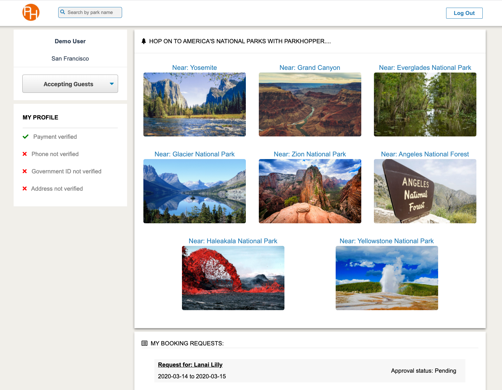

# Overview
Find places to stay near America's National Parks with local hosts who also enjoy these National Treasures.

[ParkHopper's Live Site](https://parkhopper1.herokuapp.com/)



# Built With
* React
* Redux
* Ruby on Rails
* Postgresql
# Features
### Account Creation
* Users can create accounts with unique email addresses
### Spots
* Users can see all the spots available to choose
### Bookings
* Users can request booking at a spot
* Users can update or cancel a booking
* Users cannot edit other users' bookings
### Search Spots
* Users can search spots to stay near the park you want to visit
# Code Highlights
One of the challenges during the booking form creation was using the `<DateRangePicker/>` code.  It involved dealing with react-moment.  The following code converts the date iput into the YYYY-MM-DD format.

```javascript
handleSubmit(e) {
  e.preventDefault();
  const booking = Object.assign({}, this.state)
  booking.arrival_date = moment(booking.arrival_date).format('YYYY-MM-DD');
  booking.departure_date = moment(booking.departure_date).format('YYYY-MM-DD');
  booking.spot_id = this.props.match.params.spotId;
  this.props.processForm(booking)
    .then(() => this.props.history.push('/dashboard'));
  }
```
Once the moment has been set up, `<DateRangePicker/>` can be used as below:
```javascript
<DateRangePicker
   startDate={this.state.arrival_date}
   startDateId="1"
   endDate={this.state.departure_date}
   endDateId="2"
   onDatesChange={({ startDate, endDate }) => 
     this.setState({ arrival_date: startDate, departure_date: endDate })}
   focusedInput={this.state.focusedInput}
   onFocusChange={focusedInput => this.setState({ focusedInput })}
   showClearDates={true}
   regular={true}
   numberOfMonths={1} 
   startDatePlaceholderText="yyyy-mm-dd"
   endDatePlaceholderText="yyyy-mm-dd"
 />
```
